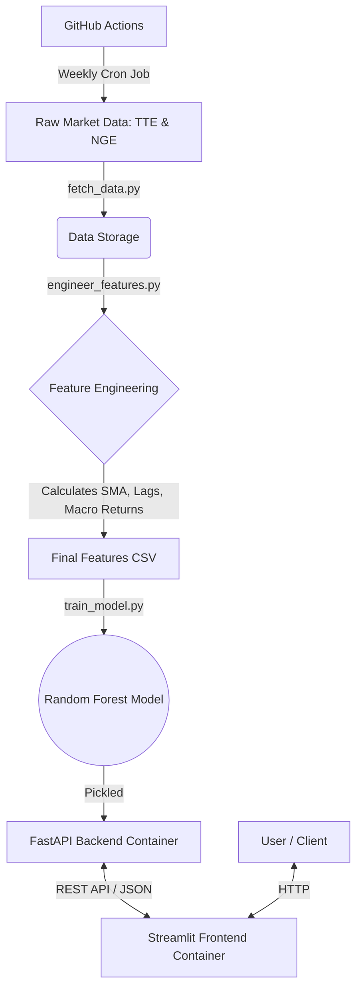
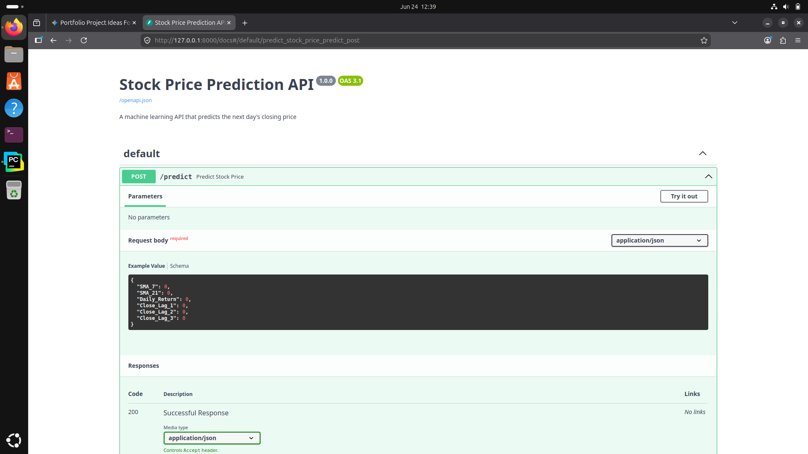
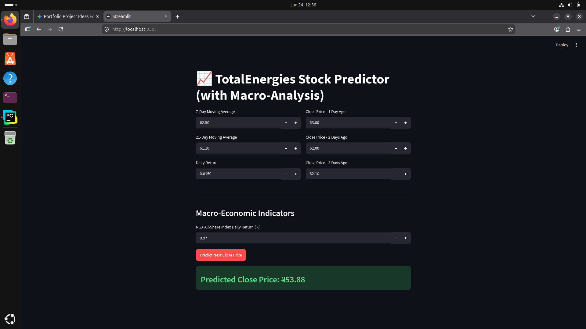

# 🚶‍♀️ End-to-End Walkthrough: Quantitative Stock Prediction API

Welcome to the technical walkthrough for the **TotalEnergies Stock Prediction API & Quantitative Dashboard**. 

This document provides a step-by-step breakdown of how data flows through the system—from raw market extraction to the interactive Streamlit user interface. It is designed to give developers, data scientists, and recruiters a deep look under the hood of this multi-container MLOps ecosystem.

---

## 🏗️ System Architecture Overview

Before diving into the code, here is a high-level view of how the different components of the system communicate.



---

## Phase 1: The Data Pipeline

### 1. Data Acquisition (`fetch_data.py`)

The foundation of any machine learning model is data. This script uses the `yfinance` library to dynamically pull historical stock market data from 2020 to the present day.

* **Target Stock:** TotalEnergies (TTE) on the Nigerian Exchange.
* **Macro Proxy:** We use the MSCI Nigeria ETF (`NGE`) as a proxy for the broader Nigerian All-Share Index. This allows the model to understand macroeconomic market health.
* **Output:** Two raw CSV files (`total_raw.csv` and `asi_raw.csv`).

### 2. Feature Engineering (`engineer_features.py`)

Raw closing prices are not enough for a quantitative model. This script merges the localized stock data with the macro market proxy and calculates actionable mathematical features:

* **Trend Indicators:** 7-Day and 21-Day Simple Moving Averages (`SMA_7`, `SMA_21`).
* **Momentum:** Local Daily Returns.
* **Memory/Lags:** The closing prices of the previous 3 days (`Close_Lag_1`, `Close_Lag_2`, `Close_Lag_3`) to give the model short-term historical context.
* **Macro Trends:** The Daily Return of the `NGE` proxy (`ASI_Daily_Return`).
* **Output:** A unified `features_tte_stock.csv` dataset ready for algorithm consumption.

---

## Phase 2: Machine Learning

### 3. Model Training (`train_model.py`)

We use a **Scikit-Learn Random Forest Regressor** to find complex, non-linear relationships in the financial data.

* The script isolates the engineered features (inputs) and the `Target_Next_Close` (the output we want to predict).
* It trains the decision trees to recognize patterns—such as how TTE reacts when its 7-day average crosses its 21-day average during a highly positive macroeconomic day.
* **Output:** A serialized `stock_model.pkl` file, which serves as the "brain" of our backend.

---

## Phase 3: Infrastructure & Orchestration

### 4. The Backend API (`app/main.py`)

The trained model is served via a high-performance, asynchronous **FastAPI** application.

* **Validation:** We use Pydantic schemas to strictly validate incoming JSON payloads, ensuring that all 7 required features (including the macro proxy) are formatted correctly.
* **Containerization:** The API is packaged inside a lightweight Docker container (`Dockerfile`), ensuring that dependency issues never break the production environment.
* **Endpoint:** Exposes a secure `POST /predict` route.

### 5. The User Interface (`frontend.py`)

A custom **Streamlit** dashboard acts as the face of the application.

* Users can input real-time market data through clean, interactive number fields.
* The frontend packages this data into a JSON payload and securely sends it over Docker's internal network to the FastAPI backend container.
* It parses the response and beautifully renders the predicted closing price.
* **Containerization:** The frontend lives in its own dedicated container (`Dockerfile.frontend`).

### 6. Multi-Container Orchestration (`docker-compose.yml`)

Instead of managing the API and the UI separately, **Docker Compose** orchestrates both. With a single command (`docker-compose up -d --build`), the system:

1. Builds both Docker images.
2. Creates an isolated, secure internal bridge network (`stock_prediction_api_default`).
3. Spins up the backend and frontend simultaneously.
4. Maps the internal Streamlit port to the host machine's `localhost:8501`.

---

## Phase 4: Automation (MLOps)

### 7. Continuous Training (GitHub Actions)

Financial markets change constantly; a static model quickly becomes obsolete.

* A YAML workflow file (`.github/workflows/retrain.yml`) acts as an automated cloud robot.
* **The Cron Job:** Every Friday at midnight, the pipeline wakes up a virtual Ubuntu runner in the cloud.
* It automatically executes `fetch_data.py`, `engineer_features.py`, and `train_model.py`.
* It seamlessly commits the newly trained `stock_model.pkl` back into the repository, ensuring the system stays perfectly calibrated without human intervention.

---
### 4. The Backend API (`app/main.py`)
The trained model is served via a high-performance, asynchronous **FastAPI** application.
* **Validation:** We use Pydantic schemas to strictly validate incoming JSON payloads, ensuring that all 7 required features (including the macro proxy) are formatted correctly.
* **Containerization:** The API is packaged inside a lightweight Docker container (`Dockerfile`).
* **Endpoint:** Exposes a secure `POST /predict` route.

<p align="center">
  
</p>

### 5. The User Interface (`frontend.py`)
A custom **Streamlit** dashboard acts as the face of the application.
* Users can input real-time market data through clean, interactive number fields.
* The frontend packages this data into a JSON payload and securely sends it over Docker's internal network to the FastAPI backend container.
* It parses the response and beautifully renders the predicted closing price.

<p align="center">
  
</p>
*Authored by Blossom Oputa | Software Engineering & DevOps*

```

```